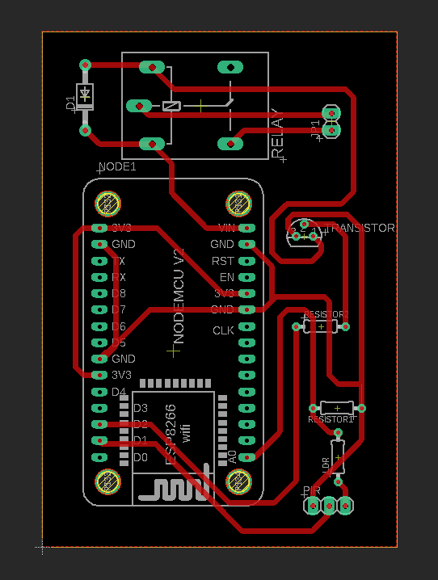
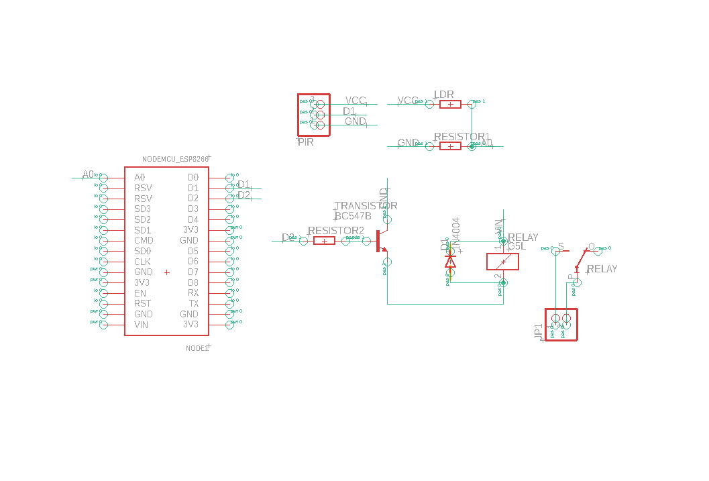
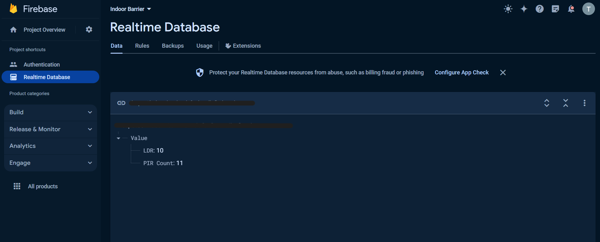

# CivetGuart-Indoor-Barrier

## Overview
One of the most common problems faced by people living in rural areas is the intrusion of civets into their homes, particularly onto house roofs. Civets tend to visit during the night, causing damage to ceilings and disturbances with their nocturnal activities.
A common solution employed by residents is the use of high-wattage bulbs (flashlights) in the affected areas during the night. While effective, this solution consumes significant power, especially considering that civets may not be visited every night, leading to unnecessary energy expenditure.

The "CivetGuart Indoor Barrier" is designed to address this issue. It is a simple device that activates the flashlight only when motion is detected, eliminating the need to keep the light on throughout the night. Additionally, it features a Light Dependent Resistor (LDR) to ensure activation only in dark environments.

The device is built using the NodeMCU microcontroller development board and connects to the Firebase real-time database via the home Wi-Fi network. Real-time monitoring of the device's operation is possible through the Firebase database, allowing users to conveniently check its status without physically accessing the device, which is typically installed on the roof.

Users can track the number of flashlight activations within specific time periods (e.g., one night) to assess the device's efficiency. This data allows users to gauge whether the device is effectively working while minimizing unnecessary power consumption.

Note: In some cases, the Light Dependent Resistor (LDR) may not be necessary, as the device is typically installed in a dark area.

Circuit Diagrams

  

  
  

Firebase Realtime DB

  

  

## Features
- **Power Efficiency:** The device ensures efficient power usage by activating the flashlight only when motion is detected, eliminating the need for continuous illumination throughout the night.
- **Real-time Monitoring with Database Integration:** The device utilizes Firebase database integration to enable real-time monitoring capabilities. Users can track flashlight activations and monitor LDR values remotely and instantly.
- **Multiple Operation Modes:**
    - Mode 1 (Basic_Motion_Light): The basic operating mode where the flashlight turns on upon detecting movement.
    - Mode 2 (Motion_Ligth_With_Firebase_Data_Logger): Extends Mode 1 functionality by logging the count of flashlight activations and the corresponding LDR values to the Firebase database.
    - Mode 3 (Advanced_Motion_Control_With_Data_Logger): Enhances functionality with advanced features, including activation based on the frequency of motion within a specified time frame, in addition to all features of Mode 2.    
- **Efficiency Analysis:** By analyzing the count of flashlight activations within specific time periods, users can draw conclusions regarding the device's efficiency and its ability to fulfil its intended purpose.

- **Multiple Operation Modes:**
    - [Mode 1 (Basic_Motion_Light)](Codes/Basic_Motion_Light/Basic_Motion_Light.ino): The basic operating mode where the flashlight turns on upon detecting movement.
    - [Mode 2 (Motion_Light_With_Firebase_Data_Logger)](#mode-2-motion_light_with_firebase_data_logger): Extends Mode 1 functionality by logging the count of flashlight activations and the corresponding LDR values to the Firebase database.
    - [Mode 3 (Advanced_Motion_Control_With_Data_Logger)](#mode-3-advanced_motion_control_with_data_logger): Enhances functionality with advanced features, including activation based on the frequency of motion within a specified time frame, in addition to all features of Mode 2. 

...

## Components Used

- NodeMCU
- PIR Motion Sensor
- LDR
- Transistor (BC547)
- Flashlight
  
 
