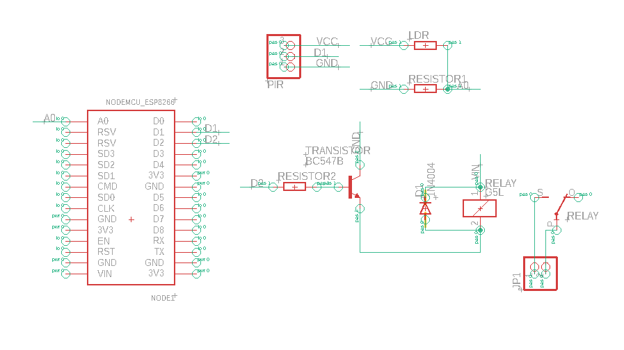

# CivetGuart-Indoor-Barrier

## Overview

Circuit Diagrams

  

  
  

## Features
- **Power Efficiency:** The device ensures efficient power usage by activating the flashlight only when motion is detected, eliminating the need for continuous illumination throughout the night.
- **Real-time Monitoring with Database Integration:** The device utilizes Firebase database integration to enable real-time monitoring capabilities. Users can track flashlight activations and monitor LDR values remotely and instantly.
- **Multiple Operation Modes:**
    - Mode 1 (Basic_Motion_Light): The basic operating mode where the flashlight turns on upon detecting movement.
    - Mode 2 (Motion_Ligth_With_Firebase_Data_Logger): Extends Mode 1 functionality by logging the count of flashlight activations and the corresponding LDR values to the Firebase database.
    - Mode 3 (Advanced_Motion_Control_With_Data_Logger): Enhances functionality with advanced features, including activation based on the frequency of motion within a specified time frame, in addition to all features         of Mode 2.
- **Efficiency Analysis:** By analyzing the count of flashlight activations within specific time periods, users can draw conclusions regarding the device's efficiency and its ability to fulfil its intended purpose.

## Components Used

- NodeMCU
- PIR Motion Sensor
- LDR
- Flashlight
  
 
